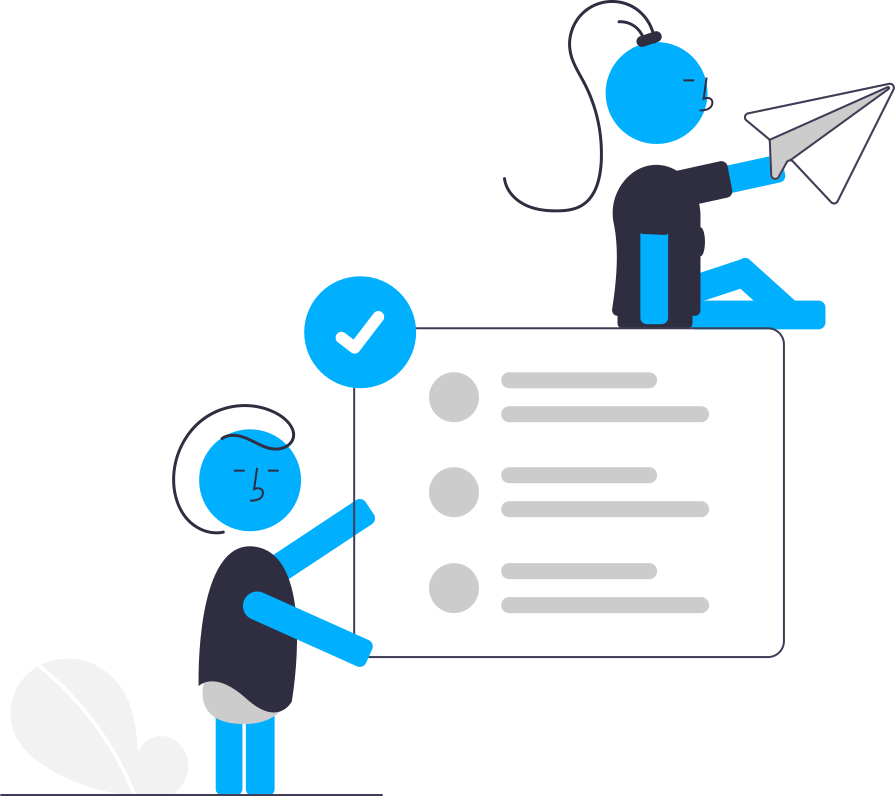
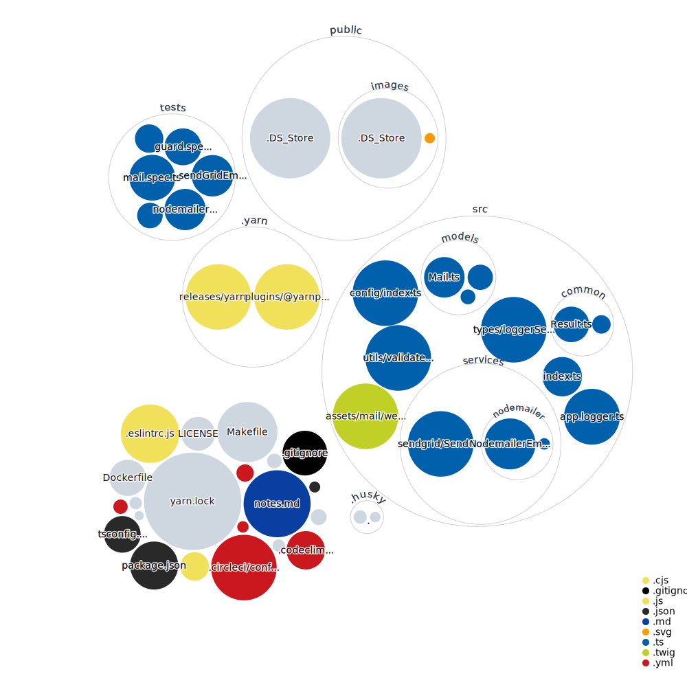

## hermes - email microservice for musings

    Musings sphere to share amazing ideas and articles with the rest of the world.

#### Simple but complicated musings

## Description

## Stack used

- TypeScript
- Node.js

## Project visualization

Here's a large-scale visualization of the repo. As I put more time into the front-end, it may change a little bit.

